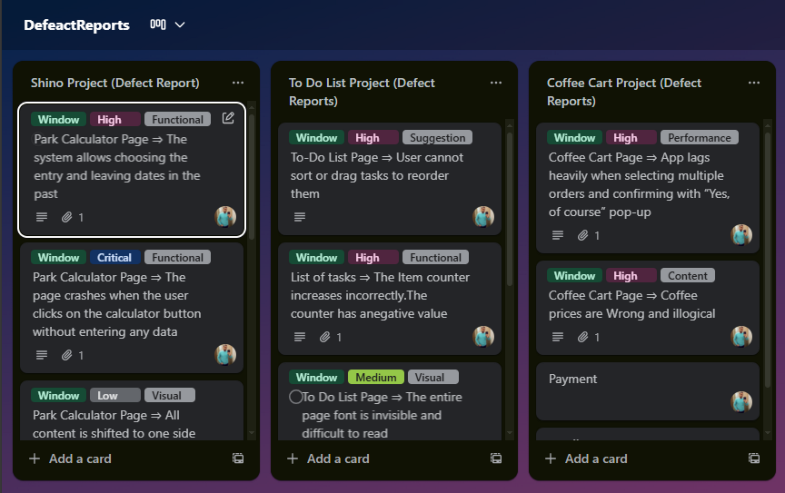
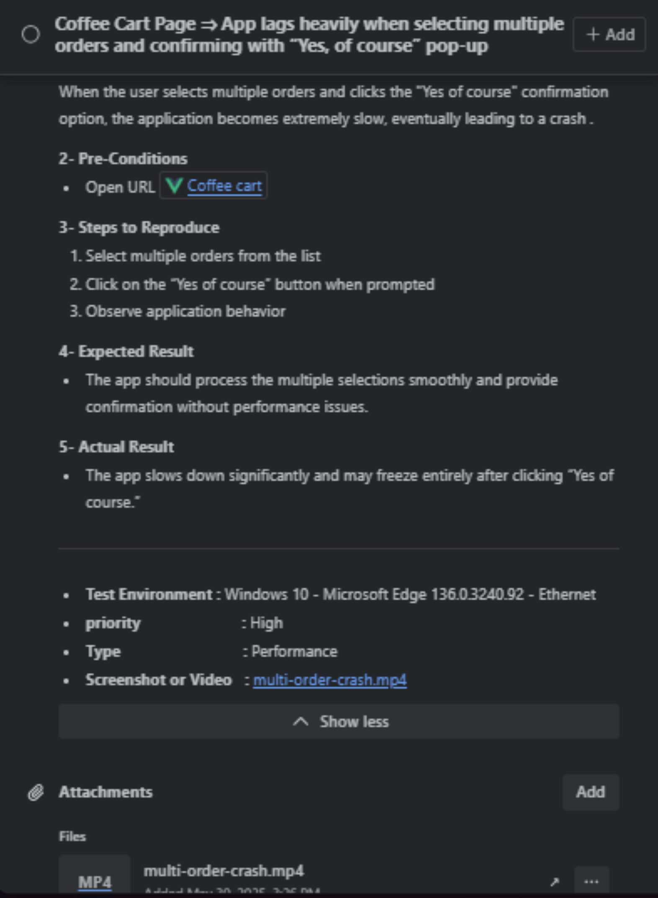

# 🌟 Sample QA Projects — To-Do List & Coffee Cart

> 🎯 *A showcase of real-world web testing, structured defect reports, and visual documentation.*

---

## 🧩 Project Overview

Welcome to my **sample QA portfolio**, featuring manual testing and defect reporting for two demo websites:

- 🗒 **To-Do List Website** — Simple task management app used for functional & UI validation.  
- ☕ **Coffee Cart Website** — Mini e-commerce cart tested for form validation, navigation, and purchase flow.
- 🛠️ **PARKING COST CALCULATOR Website** — Mini parking website tested for form validation.

These projects demonstrate **bug identification, defect documentation**, and **expected vs actual analysis** — all aligned with professional QA standards.

---

## 🛠️ Tools & Environment

| Category | Tools / Platforms |
|-----------|------------------|
| **Testing Type** | Manual Testing |
| **Browsers** | Chrome, Edge |
| **Documentation** | Trello   |
| **Screenshots** | Snipping Tool, Lightshot |
| **Reporting Format** | Defect Log + Screenshot Evidence |

---

## 🧾 Defect Report Template

| Field | Description |
|--------|-------------|
| 🆔 **Defect ID** | Unique bug identifier |
| 🧭 **Module** | Page or feature under test |
| ⚙️ **Preconditions** | Environment setup before test |
| 🪜 **Steps to Reproduce** | Detailed test steps |
| ✅ **Expected Result** | Correct system behavior |
| ❌ **Actual Result** | Observed incorrect output |
| 📊 **Severity / Priority** | Business impact rating |
| 📎 **Attachments** | Screenshot or video proof |
| 🔁 **Status** | Open / Fixed / Retest / Closed |

---

## 📸 Visual Evidence

Add screenshots of discovered defects below for clear visual reference.

```
📂 /SampleScreenshots/
   ├── 1.png
   ├── 2.png
   ├── 3.png
   ├── 4.png
```
Example embedding:
```markdown



```

---

## 👨‍💻 Author

**Lotfy Galal**  
*Software Testing Engineer*  

🌐 [LinkedIn](http://www.linkedin.com/in/lotfy-gal-b8136015a) | 💻 [GitHub](https://github.com/lotfygalal)
